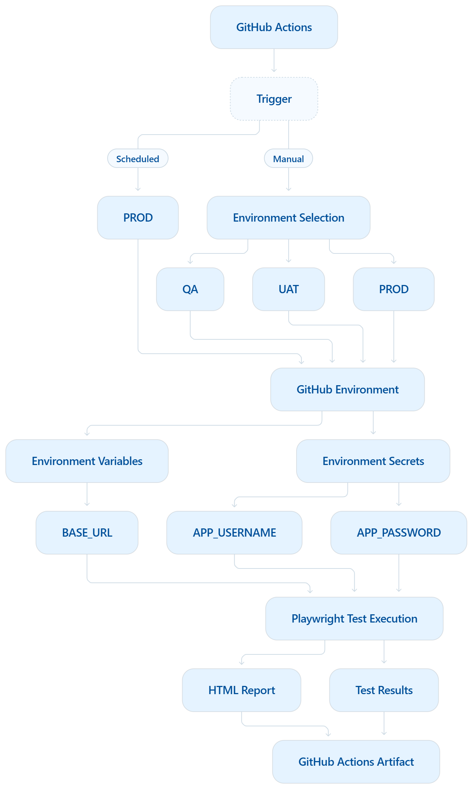
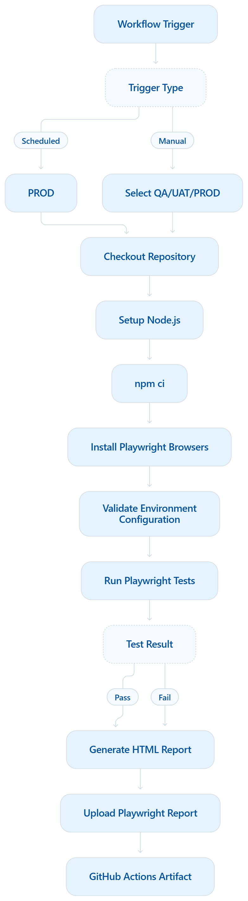

What I'd do in your project

Given the framework you've been building, I'd document it in four layers:

                 PLAYWRIGHT FRAMEWORK
                         │
        ┌────────────────┼────────────────┐
        │                │                │
        ▼                ▼                ▼
 Framework           Configuration      CI/CD
 Architecture          Layer           Architecture
        │                │                │
        ▼                ▼                ▼
 Tests → Fixtures     Environments     GitHub Actions
       → POM          Secrets          Scheduled/Manual
       → BasePage     Variables        Reports
       → Utilities    Projects         Artifacts

And then one execution flow:

Trigger
  ↓
Environment
  ↓
Configuration
  ↓
Browser
  ↓
Playwright Tests
  ↓
Assertions
  ↓
Reports
  ↓
Artifacts

